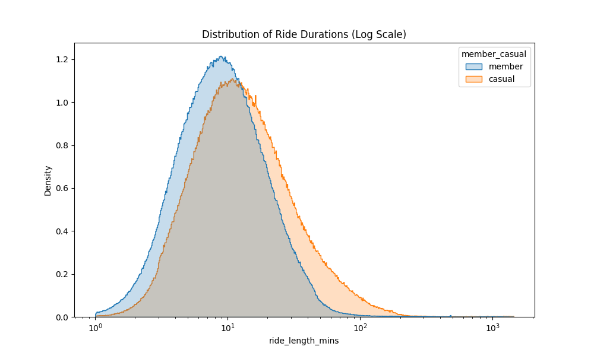
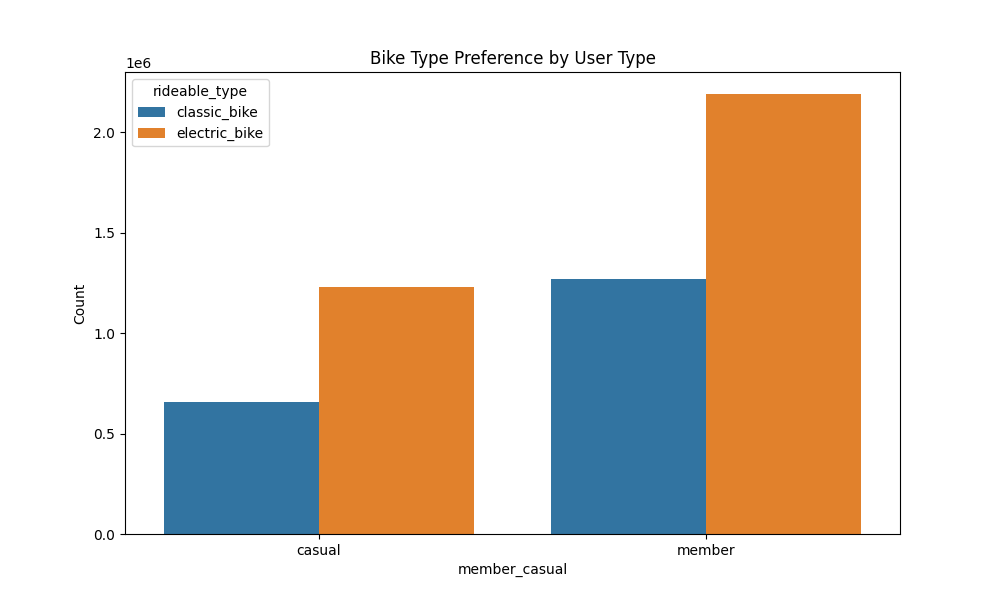
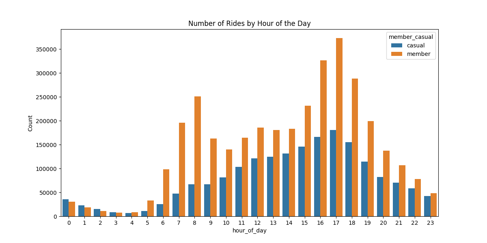
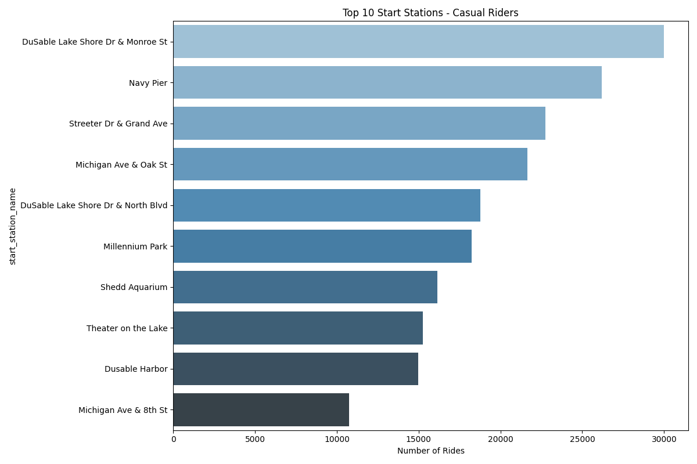
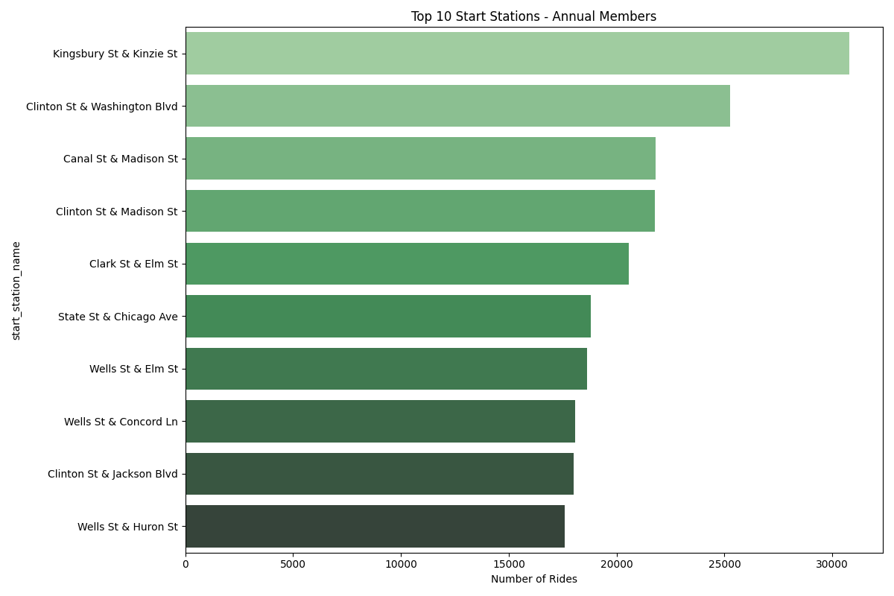

# Case Study: Cyclistic Bike-Share Analysis

## Introduction
This case study focuses on Cyclistic, a fictional bike-share company in Chicago. As a junior data analyst, the goal is to follow the data analysis process (Ask, Prepare, Process, Analyze, Share, and Act) to answer key business questions that will help guide the company's marketing strategy.

## Scenario
The Director of Marketing at Cyclistic believes the company’s future success depends on maximizing the number of annual memberships. The marketing analyst team needs to understand how casual riders and annual members use Cyclistic bikes differently. Based on these insights, the team will design a new marketing strategy to convert casual riders into annual members.

## About the Company
In 2016, Cyclistic launched a successful bike-share offering. Since then, the program has grown to a fleet of 5,824 bicycles that are geotracked and locked into a network of 692 stations across Chicago. The bikes can be unlocked from one station and returned to any other station in the system anytime.

Cyclistic offers flexible pricing plans:
*   **Casual Riders:** Customers who purchase single-ride or full-day passes.
*   **Cyclistic Members:** Customers who purchase annual memberships.

Finance analysts have concluded that annual members are much more profitable than casual riders. Moreno, the Director of Marketing, believes there is a solid opportunity to convert casual riders into members, as they are already aware of the Cyclistic program and have chosen it for their mobility needs.

## Phase 1: Ask

### Key Business Task
The primary objective is to identify the behavioral differences between casual riders and annual members of Cyclistic. By analyzing historical trip data, we aim to uncover trends that will inform a targeted marketing strategy to convert casual riders into long-term annual members, thereby driving company growth and profitability.

### Stakeholders
*   **Lily Moreno:** Director of Marketing and your manager. Responsible for the development of campaigns and initiatives to promote the bike-share program.
*   **Cyclistic Marketing Analytics Team:** A team of data analysts responsible for collecting, analyzing, and reporting data to guide marketing strategy.
*   **Cyclistic Executive Team:** The notoriously detail-oriented team that decides whether to approve the recommended marketing program.

### Guiding Questions
1.  How do annual members and casual riders use Cyclistic bikes differently?
2.  Why would casual riders buy Cyclistic annual memberships?
3.  How can Cyclistic use digital media to influence casual riders to become members?

### Conclusion: Strategic Alignment

business objective: **profit maximization through the conversion of high-potential casual riders into annual members**.

I’m focusing my analysis on the commercial drivers that turn casual riders into annual members. Rather than just observing data, I am identifying the specific behaviors that distinguish our most profitable segments. This allows me to provide the marketing team with a data-backed roadmap for high-ROI growth and help leadership make more informed strategic decisions.

## Phase 2: Prepare & Process (Data Cleaning)

To ensure the data was reliable and ready for analysis, the following cleaning and preparation steps were performed:

### 1. Handling Missing Values
- **Station Information:** A large number of trips had missing `start_station_name` and `end_station_name`. Instead of deleting these records, the missing values were filled with the label `"off-network"`. This preserves these trips for analysis and treats the lack of a station as a behavioral insight (i.e., dockless rides).
- **End Coordinates:** A small number of trips (~5,500) were missing `end_lat` and `end_lng`. These rows were dropped as the ride distance could not be calculated and the volume was low enough not to impact overall trends.

### 2. Correcting Data Integrity Issues & Handling Outliers
- **Negative/Zero Duration Rides:** Trips with a duration of less than one minute (`ride_length_mins` < 1) were removed. These are considered data errors (`ended_at` before `started_at`) or "false starts" that do not represent a valid trip.
- **Zero-Distance Rides:** Trips with a calculated distance of 0 km but a duration greater than one minute were kept. These are interpreted as valid "round-trip" journeys where the rider returned to the same starting station.
- **Extreme Duration Outliers:** Trips with a duration longer than 24 hours (1,440 minutes) were removed. These are considered anomalies, likely representing stolen bikes or system errors, and do not reflect typical user behavior.

After these steps, the dataset was clean and ready for the analysis phase, providing a more accurate foundation for comparing the behavior of casual riders and annual members.

## Phase 3: Share (Visualizations & Key Findings)

To effectively communicate the findings, a series of visualizations were created to highlight the differences in behavior between casual riders and annual members. These visualizations are available in the `img/` directory and are referenced below.

### Key Findings:

1.  **Ride Duration:**
    *   **Casual riders** take significantly longer rides on average compared to **annual members**. This suggests that casual riders may be using the bikes for leisure or tourism, while members are more likely to use them for commuting.
    *   The distribution of ride durations is heavily skewed, with most trips being short. A log scale was used to better visualize the spread.
    *   
    *   

2.  **Bike Type Preference:**
    *   **Annual members** almost exclusively use classic bikes, likely due to their focus on commuting.
    *   **Casual riders** show a higher preference for electric and docked bikes, which may be more convenient for spontaneous, recreational trips.
    *   

3.  **Usage Patterns by Time:**
    *   **Rides per Month:** Usage peaks in the summer months (June, July, August) for both groups but is more pronounced for casual riders.
    *   **Rides per Day of the Week:** Casual riders are more active on weekends, while annual members show consistent usage throughout the week, with a slight dip on weekends.
    *   **Rides per Hour:** Annual members exhibit clear morning and evening commute peaks (7-9 AM and 4-6 PM), while casual riders' usage is more evenly spread throughout the afternoon and evening.
    *   
    *   
    *   

4.  **Top Stations:**
    *   The most popular stations for **casual riders** are concentrated in tourist-heavy areas (e.g., near Navy Pier, Millennium Park).
    *   Top stations for **annual members** are located in residential and commercial areas, supporting the commuter hypothesis.
    *   
    *   

## Phase 4: Act (Recommendations)

Based on the analysis, here are three recommendations to convert casual riders into annual members:

### Recommendation 1: Launch a "Weekend Warrior" Membership

*   **Target Audience:** Casual riders who primarily use the service on weekends.

*   **The Offer:** A discounted annual membership that offers unlimited weekend rides. This would appeal to their existing behavior while encouraging them to commit to a membership.

*   **Marketing:** Promote this offer at popular weekend stations and through targeted digital ads based on location and time of day.

### Recommendation 2: Offer a "Commuter" Trial Membership

*   **Target Audience:** Casual riders who show some weekday usage, suggesting potential for commuting.

*   **The Offer:** A free or heavily discounted one-month trial of an annual membership. This allows them to experience the benefits of membership for their daily commute without a long-term commitment.

*   **Marketing:** Target users who have taken rides during peak commute hours. Use email campaigns and in-app messaging to highlight the cost savings of a membership compared to single-ride passes for daily commuters.

### Recommendation 3: Highlight the Benefits of Membership for Leisure Riders

*   **Target Audience:** Casual riders who use the bikes for leisure and tourism.

*   **The Offer:** Create marketing campaigns that showcase the benefits of membership for leisure riders, such as the convenience of not having to purchase a pass for every ride and the cost savings for frequent explorers.

*   **Marketing:** Run a "Discover Chicago" campaign that suggests scenic routes and points of interest accessible via Cyclistic. Offer a special discount on memberships for new residents or tourists who have used the service multiple times.

## Answering Key Business Questions

### Why would casual riders buy Cyclistic annual memberships?

Casual riders would be motivated to buy Cyclistic annual memberships for several reasons, primarily driven by cost savings and convenience. Our analysis has identified three key segments of casual riders who are prime candidates for conversion:

**1. The Potential Commuter:**

*   **Behavior:** These are casual riders who use the service during peak commute hours (Monday-Friday, 7-9 AM and 4-6 PM). We found **887,639** such rides in our analysis.

*   **Motivation:** A casual rider commuting twice a day for a work week would spend approximately **$29.90** on single rides. An annual membership, at an assumed cost of **
49.00**, becomes more cost-effective than single rides after only **5 weeks** of commuting. The membership offers significant savings for regular commuters.

**2. The Frequent Weekender:**

*   **Behavior:** These riders use the service frequently on weekends. On average, there are **36,277** casual rides each weekend.

*   **Motivation:** A casual rider taking 4 rides over a weekend would spend **
1.96**. While this is less than a day pass, a membership offers more flexibility and encourages more frequent use. For those who consistently use the service on weekends, an annual membership provides a more economical way to enjoy their leisure time.

**3. The Power User:**

*   **Behavior:** These are casual riders who use the service frequently, often from the same popular stations. For example, the top casual station, "DuSable Lake Shore Dr & Monroe St", had **29,979** rides from casual users.

*   **Motivation:** A hypothetical power user riding just 3 times a week would spend an estimated **$466.44** annually on single rides. This is significantly more than the **
49.00** cost of an annual membership. These users are already demonstrating a high level of engagement with the service, and a membership would offer them substantial savings.

In conclusion, by targeting these three segments with tailored marketing messages that highlight the cost savings and convenience of an annual membership, Cyclistic can effectively convert a significant portion of its casual riders into loyal annual members.

### How can Cyclistic use digital media to influence casual riders to become members?

Cyclistic can leverage digital media to deliver targeted and timely messages to casual riders, influencing them to become members. Here’s a strategy based on our analysis:

**1. Geo-Targeted Advertising:**

*   **Strategy:** Use location-based targeting to deliver ads to users who are near popular casual rider stations.
*   **Implementation:**
    *   **Identify High-Opportunity Zones:** Focus on the top 10 casual rider stations, such as "DuSable Lake Shore Dr & Monroe St," "Navy Pier," and "Streeter Dr & Grand Ave."
    *   **Platform:** Use platforms like Google Ads and Facebook Ads to create a geofence around these locations.
    *   **Messaging:** Deliver ads that are relevant to the location. For example, an ad near Navy Pier could say: "Enjoying the sights? Get unlimited rides with a Cyclistic membership and explore all of Chicago."

**2. Behavior-Based Retargeting:**

*   **Strategy:** Target users who have already shown interest in Cyclistic by visiting the website, using the app, or taking rides.
*   **Implementation:**
    *   **Website/App Visitors:** Use a tracking pixel (e.g., Facebook Pixel, Google Analytics) to create a retargeting audience.
    *   **Past Riders:** If the app or data allows, segment users who have taken multiple casual rides and target them with specific offers.
    *   **Messaging:**
        *   For **weekend riders**: "Enjoy unlimited weekend rides with a Cyclistic membership."
        *   For **frequent short-trip riders**: "Save money on your daily commute with a Cyclistic membership."

**3. Social Media Campaigns:**

*   **Strategy:** Run engaging campaigns on social media platforms to build a community and showcase the benefits of membership.
*   **Implementation:**
    *   **Content:** Share user-generated content (with permission), highlight scenic routes, and run contests.
    *   **Influencer Marketing:** Partner with local influencers to promote the Cyclistic membership.
    *   **Channels:** Focus on visually-oriented platforms like Instagram and Facebook, which are well-suited for showcasing the experience of riding a Cyclistic bike.

## Sharing Your Findings

To effectively communicate the findings of this analysis and persuade stakeholders to act on the recommendations, a compelling narrative is essential. Here’s how to present the story:

**1. Create a Compelling Narrative:**

*   **Structure:** Start with the most important takeaway: **there is a significant opportunity to convert casual riders into members, and we have a data-driven plan to do it.**
*   **The Story:**
    1.  **The Problem:** Briefly introduce the business objective: to increase profitability by converting casual riders to members.
    2.  **The Discovery:** Present the key differences between casual riders and members, using visualizations to make the points clear and memorable.
    3.  **The Solution:** Introduce the three key segments of casual riders who are prime for conversion.
    4.  **The Plan:** Outline the actionable recommendations for targeting each segment.

**2. Focus on Actionable Recommendations:**

*   **Clarity:** Each recommendation should be clear, concise, and directly linked to the data.
*   **Confidence:** Present the recommendations with confidence, supported by the analysis. For example, instead of saying "We think this might work," say "Our analysis shows that targeting this segment will lead to a high conversion rate."

**3. Use Visualizations to Tell the Story:**

*   **Impactful Charts:** Use the visualizations created in the analysis (e.g., rides per hour, top stations) to visually demonstrate the behavioral differences.
*   **Dashboard:** If possible, create a dashboard (e.g., in Tableau, Power BI, or even a well-organized Jupyter Notebook) that allows stakeholders to explore the data and see the insights for themselves.

