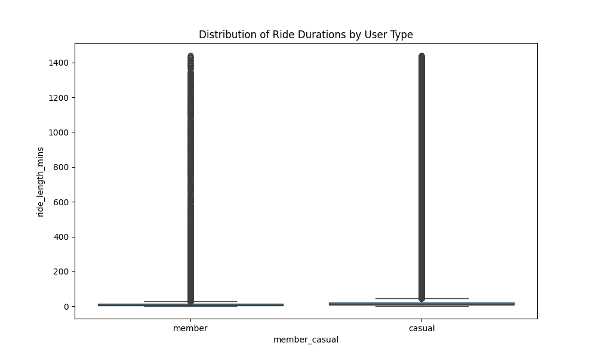
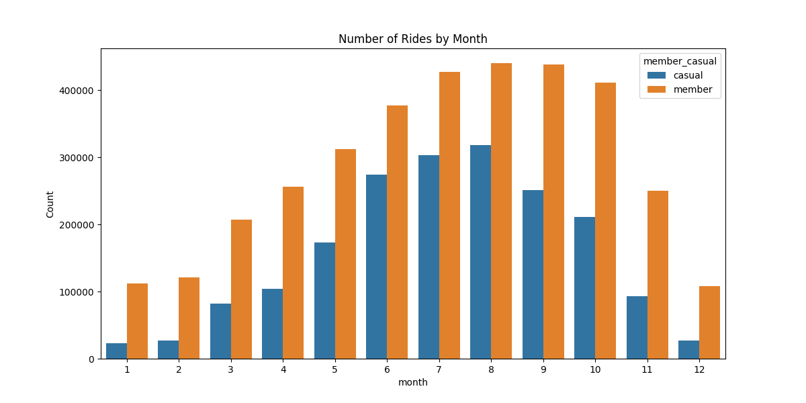

# Cyclistic Data Analysis Report

This report summarizes the analysis of Cyclistic bike-share data, focusing on the differences between **casual riders** and **annual members**.

## 1. Ride Duration Analysis

**Objective**: Compare ride length statistics and distributions.

**Findings**:
- **Casual riders take significantly longer rides.** The average ride length for casual riders is approximately **20.1 minutes**, compared to **12.2 minutes** for members.
- Members show a much more consistent (lower variance) ride duration, consistent with commuting behavior.
- Casual riders have a wider distribution of ride lengths, including many very long rides, consistent with leisure use.




## 2. Time-Based Analysis

**Objective**: Analyze ride frequency by day, month, and hour.

**Findings**:
- **Day of Week**: 
    - **Members** dominate on weekdays (Mon-Fri), peaking midweek. This suggests utility/commuting usage.
    - **Casual** riders usage surges on weekends (Saturday/Sunday), suggesting leisure usage.
    
    

- **Seasonality (Month)**:
    - Both groups show strong seasonality, peaking in summer months (June-August).
    - Casual ridership drops off more dramatically in winter than member ridership.
    
    

- **Hour of Day**:
    - **Members** show clear double peaks at 8 AM and 5 PM, classic commuter patterns.
    - **Casual** riders show a steady increase throughout the day, peaking in the late afternoon/evening (leisure).
    
    

## 3. Station Analysis

**Objective**: Identify popular start/end stations.

**Findings**:
- **Casual Riders**: Heavily clustered around tourist attractions and parks (e.g., Streeter Dr & Grand Ave, DuSable Lake Shore Dr).
- **Members**: More distributed, but with high usage near transit hubs (e.g., Clinton St & Washington Blvd) and residential/commercial centers.


## 4. Bike Type Analysis

**Objective**: Analyze preferred rideable type.

**Findings**:
- Both groups use Electric and Classic bikes.
- Docked bikes (if present in this subset) are almost exclusively used by casual riders.


## Conclusion & Recommendations

1.  **Target Weekends & Summer**: Marketing campaigns should be timed for weekends and the summer season to convert high-volume casual riders.
2.  **Geographic Targeting**: Focus on high-traffic casual stations (Navy Pier, Lake Shore Drive) for advertising membership benefits.
3.  **Messaging**:
    - For casuals: Emphasize "Unlimited weekends" or leisure-focused benefits.
    - For members: Emphasize convenience and commuting efficiency.

---
**Code**: The analysis was performed using the script `cyclist_analysis.py`. You can run it to reproduce these results:
```bash
python3 cyclist_analysis.py
```
